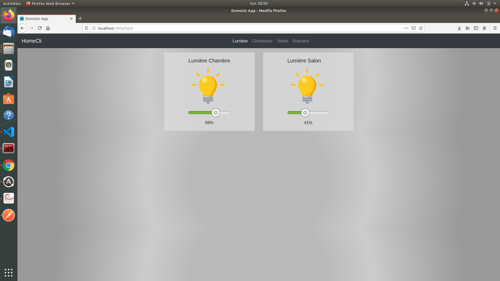
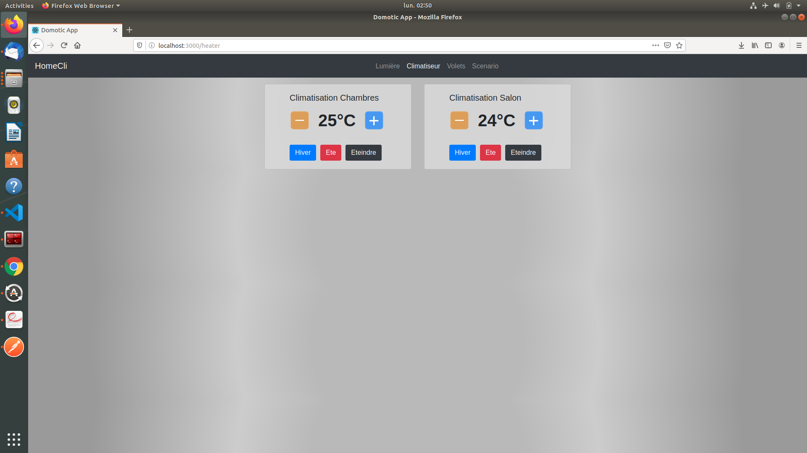
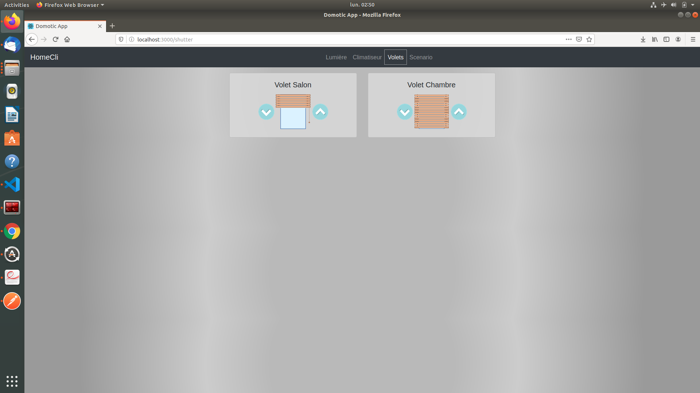
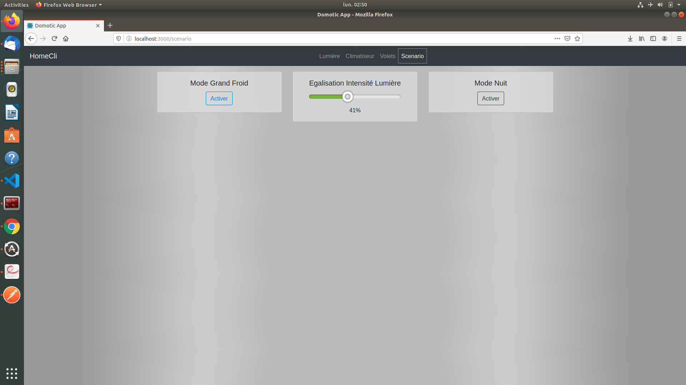

# Domotique App

## Projet d'Application Web de Gestion des divers appareils d'une maison connecté.

* Back-End : PHP7.4 / Symphony , Base de donnée MYSQL
* Front-End: ReactJS  

<h2>Lumière</h2>  
  

Permet de gerer l'insentité de la lumière via le Range Slider present en dessous de l'icone de la lumière, possibilité d'eteindre ou d'allumer la lumière en cliquant directement sur l'ampoule.
  ______________________________________________________________________________________________
<h2>Chauffage / Climatisation</h2>

Possibilité de varier la Climatisation de 16°c à 30°c maximum, Mode Hiver et Mode été disponible, ainsi que la possibilité d'eteindre la Climatisation.
  ______________________________________________________________________________________________
<h2>Volets</h2>

Possibilité de fermer ou d'ouvrir les Volets en appuyant sur les boutons present à droite de l'image de fenêtre.
  ______________________________________________________________________________________________
<h2>Scenario</h2>

3 Scenario présent:  

* Mode "Grand froid"; Ouvre toutes les climatisations à 30° et Ferme tous les volets.
* Mode "Egalisation d'Intensité"; Permet d'egaliser l'intensité de toutes les lumières
* Mode "Nuit", Eteignant toutes les lumières, fermant les volets et eteignant les climatisations.
